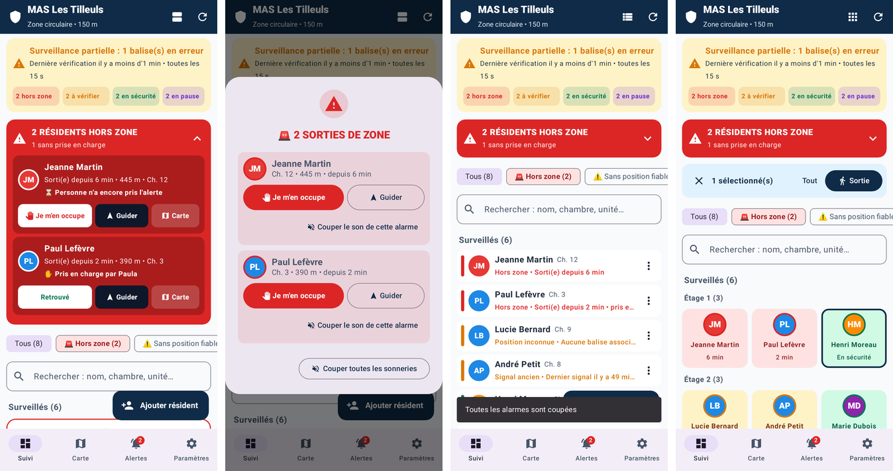
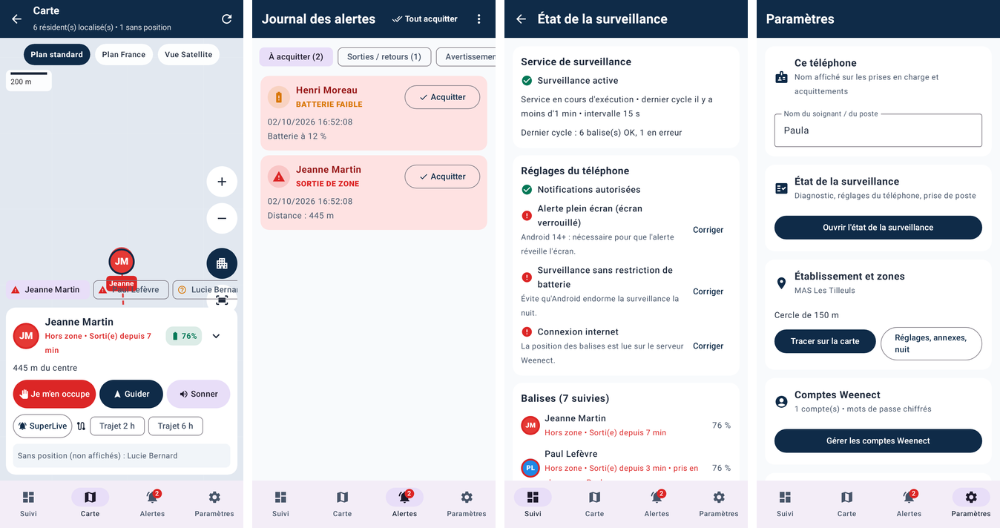
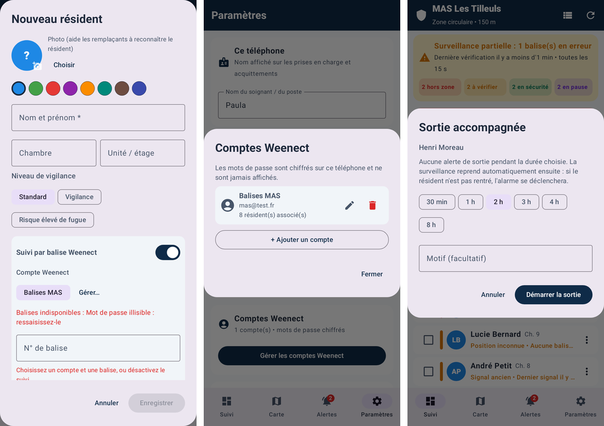
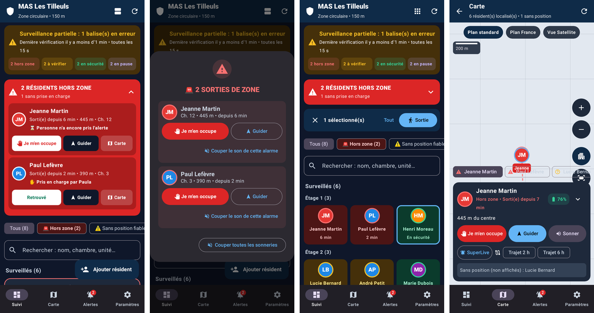
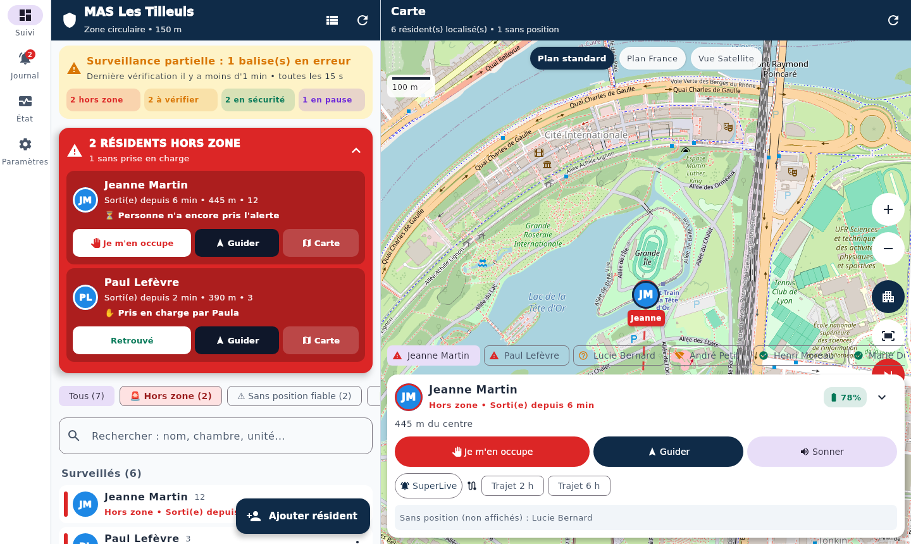
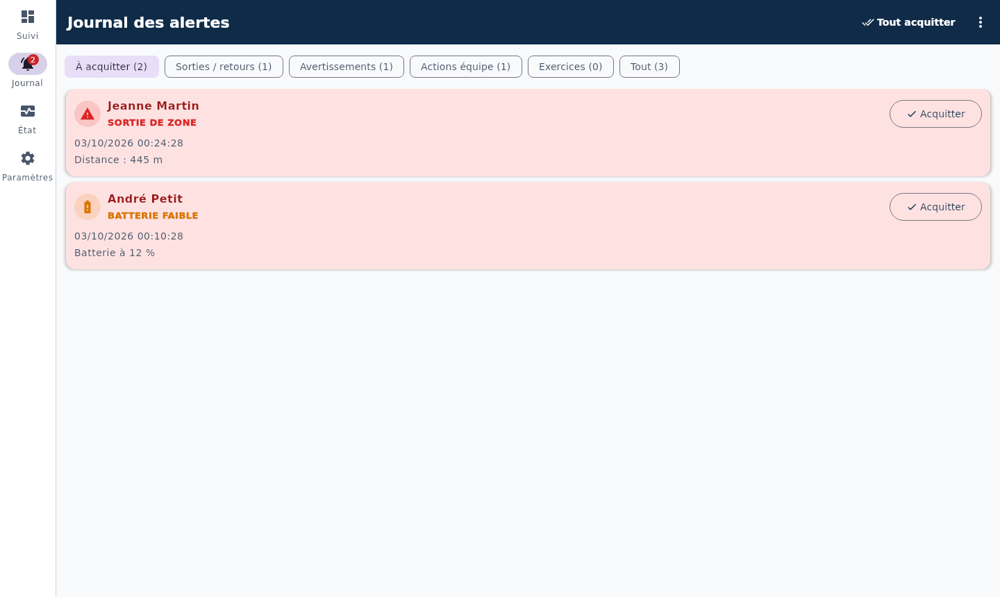
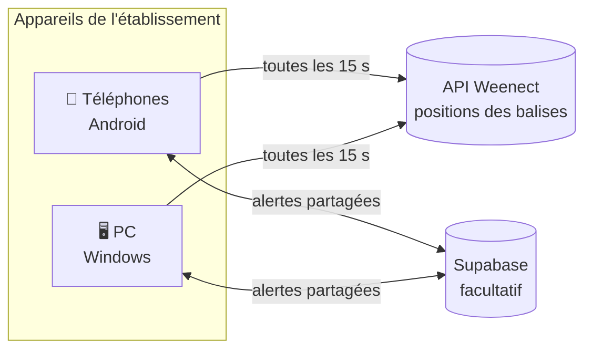

<div align="center">


# Alerte Résidents

**Surveillance et alerte en temps réel des résidents équipés de balises GPS Weenect**<br>
pour les établissements médico-sociaux (MAS, EHPAD, FAM).

[](https://github.com/aciderix/Weenect-follow/releases/latest)
[](https://github.com/aciderix/Weenect-follow/actions/workflows/build-apk.yml)
[](https://github.com/aciderix/Weenect-follow/actions/workflows/build-windows.yml)
[](https://github.com/aciderix/Weenect-follow/actions/workflows/supabase-keepalive.yml)


[**Télécharger**](https://github.com/aciderix/Weenect-follow/releases/latest) ·
[Captures](#captures) ·
[Installation](#installation) ·
[Partage entre appareils](docs/SUPABASE.md) ·
[Développement](#développement)

</div>

---

Quand un résident équipé d'une balise Weenect quitte la zone de l'établissement, **les téléphones et les PC de l'équipe sonnent** et affichent une alarme plein écran. Il suffit d'un geste pour **prendre en charge**, **guider jusqu'au résident** ou **déclarer qu'il est retrouvé**.

L'app est conçue pour la nuit et les cas dégradés. En cas de doute (réseau coupé, balise muette, position ancienne), elle **alerte** au lieu d'afficher « en sécurité ».

## Sommaire

- [Fonctionnalités](#fonctionnalités)
- [Captures](#captures)
- [Installation](#installation)
- [Partage entre appareils (Supabase)](#partage-entre-appareils-supabase)
- [Comment ça marche](#comment-ça-marche)
- [Sécurité et données](#sécurité-et-données)
- [Développement](#développement)
- [Documentation](#documentation)
- [Crédits et avertissement](#crédits-et-avertissement)

## Fonctionnalités

| | |
|---|---|
| 🚨 **Alarme de sortie de zone** | Sirène intégrée (ou sonnerie du téléphone), volume forcé au maximum, alarme plein écran même téléphone verrouillé, rappel sonore tant que personne ne prend en charge |
| 🛡️ **Surveillance « fail-safe »** | État réel affiché en permanence ; une panne réseau ne coupe jamais une alarme ; statuts *Position inconnue* et *Signal ancien* ; avertissements batterie faible et balise muette |
| 👥 **Plusieurs résidents** | Tri par urgence, vues détaillée / compacte / grille, filtres, regroupement par étage ou unité, recherche, bandeau multi-alertes |
| 🗺️ **Carte** | Photos ou initiales, regroupement des marqueurs, trajet sur 2 h ou 6 h, plan ou satellite, guidage piéton vers le résident |
| 📍 **Zones** | Cercle ou polygone tracé sur la carte, zones annexes (jardin, parking), zones autorisées la nuit uniquement, fréquence de vérification jour / nuit |
| 🚶 **Sorties accompagnées** | Suspension de la surveillance d'un ou plusieurs résidents pour une durée donnée, reprise automatique |
| 📒 **Journal** | Sorties, retours, prises en charge, avertissements, exercices ; acquittement ; export PDF / CSV ; prise de poste tracée |
| 🖥️ **Application Windows** | Poste fixe qui sonne, démarrage automatique, fenêtre au premier plan pendant une alarme, icône près de l'horloge, installateur MSI |
| 🔗 **Partage entre appareils** | Avec Supabase : une sortie sonne sur tous les appareils, « Je m'en occupe » coupe l'alarme partout avec le nom du soignant, et un résident ajouté sur un appareil apparaît automatiquement sur tous les autres |
| 🔐 **Sécurité** | Mots de passe Weenect chiffrés (Keystore Android / DPAPI Windows), export de configuration chiffré, paramètres protégés par code PIN |

## Captures

### Android

<p align="center">
  
</p>
<p align="center"><em>Tableau de bord, alarme multi-résidents, vues compacte et grille</em></p>

<p align="center">
  
</p>
<p align="center"><em>Carte, journal des alertes, état de la surveillance, paramètres</em></p>

<details>
<summary>Plus de captures (formulaires, mode sombre)</summary>
<br>
<p align="center"></p>
<p align="center"></p>
</details>

### Windows

<p align="center">
  
</p>
<p align="center"><em>Application Windows : liste des résidents et carte côte à côte</em></p>

<details>
<summary>Journal des alertes (Windows)</summary>
<br>
<p align="center"></p>
</details>

<sub>Captures générées automatiquement par les tests d'interface, avec un établissement et des résidents fictifs.</sub>

## Installation

Les fichiers à installer sont dans les [**Releases**](https://github.com/aciderix/Weenect-follow/releases/latest).

### 📱 Android
1. Téléchargez `AlerteResidents-x.y.z-android.apk` sur le téléphone et ouvrez-le. Autorisez l'installation depuis cette source si Android le demande.
2. Au premier lancement, acceptez les **notifications** et, dans **Paramètres › État de la surveillance**, corrigez chaque point en rouge : alerte plein écran, batterie sans restriction, relance automatique…
   Sur Xiaomi, Samsung, Huawei, Oppo, OnePlus…, suivez aussi le **guide de la marque** proposé sur cet écran (démarrage automatique, appli verrouillée dans les applis récentes) : ces téléphones peuvent arrêter la surveillance pour économiser la batterie. Si cela arrive quand même, l'appli se relance seule et l'interruption est inscrite au journal.
3. Ajoutez le **compte Weenect** de l'établissement, tracez la **zone**, puis ajoutez les **résidents** et associez à chacun sa balise.
4. Faites un **test d'alarme** (Paramètres › Son de l'alarme › Tester maintenant).

### 🖥️ Windows
Téléchargez `AlerteResidents-x.y.z-windows.msi` puis lancez-le. L'installation se fait sans droits administrateur. L'application démarre ensuite toute seule avec Windows.
→ Guide complet : [docs/WINDOWS.md](docs/WINDOWS.md) (démarrage automatique, déploiement sur plusieurs postes, proxy…).

### Installer un autre appareil avec la même configuration
- **Sans serveur** : sur l'appareil configuré, ouvrez **Paramètres › Sauvegarde › Exporter ou importer la configuration** puis exportez ; les mots de passe sont chiffrés par un code. Sur le nouvel appareil, importez le fichier depuis le même écran.
- **Avec Supabase** : rien à faire. Résidents, comptes Weenect et zone se synchronisent automatiquement dès que l'appareil est connecté au projet. Saisissez la même phrase secrète partout pour partager aussi les mots de passe Weenect.

## Partage entre appareils (Supabase)

Sans serveur, chaque appareil surveille et sonne **seul**. En reliant tous les appareils de l'établissement à un projet [Supabase](https://supabase.com) (gratuit pour un établissement), ils coordonnent leurs alertes :

| Sur un appareil | Sur tous les autres |
|---|---|
| Sortie détectée | ça sonne aussi (« Signalé par : PC infirmerie ») |
| « Je m'en occupe » | l'alarme s'arrête, avec le nom du soignant |
| « Retrouvé » ou retour confirmé par la balise | l'alerte est levée |
| Sortie accompagnée | la surveillance est suspendue |
| Résident ajouté, modifié ou retiré | idem sur tous, automatiquement |

- **La surveillance reste locale** : si Supabase est injoignable, chaque appareil continue de sonner normalement.
- **Universel** : l'app se connecte à n'importe quel projet. Le schéma est versionné dans [`supabase/migrations/`](supabase/migrations).

→ Mise en place pas à pas (environ 15 minutes), sécurité et RGPD : [**docs/SUPABASE.md**](docs/SUPABASE.md)

## Comment ça marche



1. **Chaque appareil** interroge lui-même l'API Weenect (fréquence réglable, différente le jour et la nuit) et compare la position de chaque balise à la zone.
2. Une **sortie** n'est confirmée qu'avec une position suffisamment précise et un second relevé, ou après 60 s, pour éviter les fausses alertes.
3. L'appareil **sonne** et, si le partage est configuré, prévient les autres via Supabase.
4. Les résidents sont reconnus d'un appareil à l'autre par l'**identifiant de leur balise** : aucun identifiant interne à synchroniser.

### Architecture du code

| Module | Contenu |
|---|---|
| [`core/`](core) | Kotlin/JVM partagé : API Weenect, évaluation de zone, statuts, sauvegarde, chiffrement, client Supabase et moteur de partage |
| [`app/`](app) | Application Android (Jetpack Compose, Room, service au premier plan, alarmes, notifications) |
| [`desktop/`](desktop) | Application Windows (Compose Multiplatform, zone de notification, démarrage automatique, installateur MSI) |
| [`supabase/`](supabase) | Schéma SQL versionné (tables, RLS, fonctions) et scripts facultatifs |

## Sécurité et données

- **Identifiants Weenect** : chiffrés sur l'appareil (Android Keystore, DPAPI sous Windows). Ils ne sont jamais envoyés en clair, y compris dans les exports et la configuration partagée, chiffrés par un code ou une phrase secrète.
- **Aucun journal réseau** en production. Les sauvegardes automatiques Android sont désactivées.
- **Supabase** : Row Level Security sur toutes les tables, accès réservé aux comptes autorisés, clé publique sans accès aux données, pas de suivi GPS continu stocké, purge automatique de l'historique.
- ⚠️ Les noms des résidents et l'historique de leurs sorties peuvent constituer des **données de santé**. Avant d'activer le partage, lisez la section [RGPD / HDS](docs/SUPABASE.md#données-personnelles-rgpd) et faites valider le choix d'hébergement par votre DPO.

## Développement

**Prérequis** : JDK 21, Android SDK 36 (pour `app`). Gradle est fourni par le wrapper.

```bash
./gradlew assembleDebug                 # APK Android de debug
./gradlew :desktop:run                  # lancer l'application Windows (fonctionne aussi sous Linux / macOS)
./gradlew :desktop:packageMsi           # installateur Windows (à lancer sous Windows)

./gradlew :core:test                    # moteur, partage Supabase, chiffrement, sauvegarde
./gradlew testDebugUnitTest             # Android : Room, migrations, moteur bout en bout, rendu des écrans
./gradlew :desktop:test                 # Windows : stockage, instance unique, interface
```

### Structure du dépôt

```
├── app/                    Application Android
├── core/                   Logique partagée Android / Windows
├── desktop/                Application Windows
├── supabase/
│   ├── migrations/         Schéma SQL versionné (à exécuter une fois par projet)
│   └── optional/           Scripts facultatifs (purge automatique)
├── docs/                   Documentation, captures et logo
├── .github/workflows/      Intégration continue, release, keepalive Supabase
└── CHANGELOG.md            Journal des versions
```

### Intégration continue

| Workflow | Déclencheur | Rôle |
|---|---|---|
| [Build Android APK](.github/workflows/build-apk.yml) | push / PR sur `main` | tests Android et APK de debug |
| [Build Windows app](.github/workflows/build-windows.yml) | push / PR | tests `core` et `desktop`, puis installateur MSI |
| [Release](.github/workflows/release.yml) | tag `v*` | APK et MSI publiés dans une release GitHub |
| [Supabase keepalive](.github/workflows/supabase-keepalive.yml) | 4 fois par jour | évite la mise en pause du projet Supabase gratuit |

### Publier une version

1. Mettez à jour `versionName` / `versionCode` (`app/build.gradle.kts`), `packageVersion` (`desktop/build.gradle.kts`) et [CHANGELOG.md](CHANGELOG.md).
2. `git tag v2.1.0 && git push origin v2.1.0`, ou sur GitHub **Actions › Release › Run workflow** en saisissant `2.1.0`. Le workflow **Release** crée le tag si besoin, puis construit et publie l'APK et le MSI.
3. **Signature Android** : par défaut, les APK sont signés avec la **clé de test partagée** du dépôt (`debug.keystore.base64`). Elle est stable d'une version à l'autre, donc une mise à jour s'installe par-dessus la précédente sans désinstaller ni perdre les données. Comme cette clé est publique, n'importe qui pourrait signer un APK installable par-dessus. Avant un déploiement large, passez à une **clé privée** :
   ```bash
   keytool -genkey -v -keystore upload.jks -alias upload -keyalg RSA -keysize 2048 -validity 10000
   ```
   Ajoutez ensuite les secrets du dépôt `ANDROID_KEYSTORE_BASE64` (sortie de `base64 -w0 upload.jks`), `ANDROID_STORE_PASSWORD` et `ANDROID_KEY_PASSWORD`. Changer de clé oblige à désinstaller l'app une dernière fois sur chaque téléphone ; avec le partage Supabase, résidents, comptes et zone reviennent seuls. Conservez précieusement `upload.jks` : sans lui, impossible de publier une mise à jour installable par-dessus.

## Documentation

| Document | Contenu |
|---|---|
| [docs/SUPABASE.md](docs/SUPABASE.md) | Partage entre appareils : rôle, données stockées, mise en place, sécurité, RGPD |
| [docs/WINDOWS.md](docs/WINDOWS.md) | Application Windows : installation, démarrage automatique, déploiement |
| [docs/AUDIT.md](docs/AUDIT.md) | Audit initial de l'application et détail des corrections de la version 2.0 |
| [CHANGELOG.md](CHANGELOG.md) | Journal des versions |

## Crédits et avertissement

- Accès à l'API Weenect inspiré de [weenect-go](https://github.com/aciderix/weenect-go).
- Fonds de carte © contributeurs [OpenStreetMap](https://www.openstreetmap.org/copyright) et [OSM France](https://www.openstreetmap.fr/) ; imagerie satellite © Esri. Recherche d'adresses : [Base Adresse Nationale](https://adresse.data.gouv.fr/) et Nominatim.
- Sirène : « Alarme détecteur de fumée 3 », La Sonothèque.

> **Avertissement** — Projet indépendant, **non affilié à Weenect**. Alerte Résidents est une aide à la surveillance : ce n'est pas un dispositif médical certifié, et l'app ne remplace ni la présence ni la vigilance de l'équipe soignante. Sa fiabilité dépend du réseau, de l'API Weenect et de l'état des balises : testez l'alarme à chaque prise de poste.
